# Ejemplos de Domain-Driven Design en el Libro

Este archivo describe cada uno de los ejemplos incluidos en el libro, proporcionando una explicación detallada de su arquitectura y cómo se han modelado utilizando los principios de DDD. Los diagramas se han creado utilizando **C4 Model** y la sintaxis de **Mermaid**.

## 1. Ejemplo 1: Sistema de Preguntas y Respuestas (QnA)

El sistema QnA es un ejemplo simplificado similar a Stack Overflow, donde los usuarios pueden realizar preguntas, responderlas y votar en las respuestas. Este ejemplo se ha modelado con una arquitectura basada en DDD que incluye los siguientes elementos:

### Diagrama de Contexto

```mermaid
    C4Context
    title System Context Diagram for QnA Platform

    %% Definition of People (Actors)
    Person(User, "User", "Interacts with the platform by asking questions, providing answers, and voting.")
    Person(Moderator, "Moderator", "Moderates content and manages users.")
    Person(Admin, "Administrator", "Manages system configuration and performs administrative tasks.")

    %% Definition of the Main System
    Enterprise_Boundary(QnA_Boundary, "QnA System Boundary") {
        System(QnA_WebApp, "QnA Web Application", "Web interface for users and moderators to interact with the platform.")
        System(QnA_API, "QnA REST API", "Provides data and functionality to interact with the QnA system.")
        System(Sync_Service, "Sync Service", "Synchronizes data between the system and external sources.")
        System(Stats_Service, "Statistics Service", "Generates reports and statistics based on platform activity.")
        System(Notification_Service, "Notification Service", "Handles sending notifications to users.")
        
        %% External Systems
        SystemDb(SQLServer, "SQL Database", "Stores user information, questions, answers, and votes.")
        SystemDb(MongoDB, "MongoDB", "NoSQL database for optimized read views.")
        SystemQueue(RabbitMQ, "RabbitMQ", "Messaging system for coordinating events between services.")
        System(Seq, "Seq", "Centralized logging system for analyzing application logs and events.")
        System(Email_Service, "Email Service", "Sends email notifications to users.")
    }

    %% Relationships between People and Systems
    Rel(User, QnA_WebApp, "Interacts with the platform through the web interface")
    Rel(Moderator, QnA_WebApp, "Moderates content and manages users")
    Rel(Admin, QnA_API, "Manages system configuration")

    %% Relationships between Systems
    Rel(QnA_WebApp, QnA_API, "Sends requests to REST API")
    Rel(QnA_API, SQLServer, "Stores and retrieves data for questions, answers, and users")
    Rel(QnA_API, MongoDB, "Retrieves optimized read views")
    Rel(QnA_API, RabbitMQ, "Publishes and subscribes to events")
    Rel(Sync_Service, RabbitMQ, "Synchronizes data between services")
    Rel(Stats_Service, RabbitMQ, "Processes events for generating statistics")
    Rel(Notification_Service, RabbitMQ, "Handles notification events")
    Rel(Notification_Service, Email_Service, "Sends email notifications to users")
    Rel(QnA_API, Seq, "Logs application events and errors")

    %% Styles and Layout Configuration
    UpdateElementStyle(User, $fontColor="black", $bgColor="lightyellow", $borderColor="black")
    UpdateElementStyle(Moderator, $fontColor="black", $bgColor="lightyellow", $borderColor="black")
    UpdateElementStyle(Admin, $fontColor="black", $bgColor="lightyellow", $borderColor="black")

    UpdateRelStyle(User, QnA_WebApp, $textColor="blue", $lineColor="blue", $offsetX="5")
    UpdateRelStyle(QnA_WebApp, QnA_API, $textColor="green", $lineColor="green", $offsetY="-10")
    UpdateRelStyle(QnA_API, SQLServer, $textColor="red", $lineColor="red", $offsetY="-20", $offsetX="10")
    UpdateRelStyle(QnA_API, MongoDB, $textColor="orange", $lineColor="orange", $offsetY="20", $offsetX="10")
    UpdateRelStyle(QnA_API, RabbitMQ, $textColor="purple", $lineColor="purple", $offsetY="-30", $offsetX="10")
    UpdateRelStyle(RabbitMQ, Sync_Service, $textColor="gray", $lineColor="gray", $offsetY="-40", $offsetX="20")
    UpdateRelStyle(RabbitMQ, Stats_Service, $textColor="gray", $lineColor="gray", $offsetY="-50", $offsetX="30")
    UpdateRelStyle(RabbitMQ, Notification_Service, $textColor="gray", $lineColor="gray", $offsetY="-60", $offsetX="40")

    UpdateLayoutConfig($c4ShapeInRow="4", $c4BoundaryInRow="1")



```



### Diagrama de Contenedores

```mermaid
C4Context
    title Sistema de Preguntas y Respuestas (QnA) - Diagrama de Contexto
    Person(Usuario, "Usuario", "Realiza preguntas y respuestas en la plataforma")
    Person(Moderador, "Moderador", "Modera el contenido y gestiona usuarios")
    Person(Admin, "Administrador", "Administra la configuración del sistema")

    System_Boundary(QnA, "Sistema QnA") {
        System(QnA_Web, "QnA Web App", "Interfaz web donde los usuarios interactúan con el sistema")
        System(QnA_API, "API REST", "Provee acceso a datos y funcionalidades del sistema")
        System(Sync_Service, "Sync Service", "Sincroniza los datos entre el sistema y otros servicios")
        System(Stats_Service, "Stats Service", "Genera estadísticas y reportes de la actividad en el sistema")
        System(Notification_Service, "Notification Service", "Gestiona el envío de notificaciones a los usuarios")
        System_Ext(SQLServer, "Base de Datos SQL", "Almacena usuarios, preguntas y respuestas")
        System_Ext(MongoDB, "MongoDB", "Base de datos NoSQL para vistas optimizadas")
        System_Ext(RabbitMQ, "RabbitMQ", "Sistema de mensajería para coordinar eventos entre microservicios")
        System_Ext(Seq, "Seq", "Sistema de logging centralizado para analizar logs y eventos")
        System_Ext(Email_Service, "Servicio de Email", "Envía notificaciones y confirmaciones a los usuarios")
    }

    Usuario -> QnA_Web : Interactúa a través de la interfaz web
    Moderador -> QnA_Web : Modera el contenido
    Admin -> QnA_API : Gestiona configuraciones del sistema
    QnA_Web -> QnA_API : Solicita datos y operaciones
    QnA_API -> SQLServer : Realiza operaciones CRUD en la base de datos
    QnA_API -> MongoDB : Consulta vistas de datos
    QnA_API -> RabbitMQ : Publica y suscribe eventos
    Sync_Service -> RabbitMQ : Sincroniza eventos entre servicios
    Stats_Service -> RabbitMQ : Procesa eventos para generar estadísticas
    Notification_Service -> RabbitMQ : Gestiona eventos de notificaciones
    Notification_Service -> Email_Service : Envía emails a los usuarios
    QnA_API -> Seq : Registra logs de la aplicación

```

### Diagrama de Componentes

```mermaid
C4Component
    title QnA API - Diagrama de Componentes
    Container_Boundary(API, "API REST QnA") {
        Component(QuestionController, "Question Controller", "ASP.NET Core", "Maneja preguntas de los usuarios")
        Component(AnswerController, "Answer Controller", "ASP.NET Core", "Gestiona respuestas a las preguntas")
        Component(VoteController, "Vote Controller", "ASP.NET Core", "Permite votar en preguntas y respuestas")
        Component(AuthService, "Servicio de Autenticación", "ASP.NET Core", "Gestiona autenticación y permisos de usuario")
        Component(DbContext, "Contexto de Base de Datos", "Entity Framework Core", "Provee acceso a la base de datos")
    }

    QuestionController -> DbContext : CRUD preguntas
    AnswerController -> DbContext : CRUD respuestas
    VoteController -> DbContext : CRUD votos
    AuthService -> DbContext : Valida credenciales
```

## Descripción del Modelo

El sistema de preguntas y respuestas (QnA) se compone de tres capas principales:

1. **Capa de Aplicación**: Maneja las interacciones del usuario y controla el flujo de datos entre la capa de presentación y la lógica de negocio.
2. **Capa de Dominio**: Contiene las reglas de negocio, validaciones y lógica de la aplicación. Aquí se define cómo se gestionan las preguntas, respuestas y votos.
3. **Capa de Infraestructura**: Gestiona la persistencia de datos en una base de datos SQL Server y las integraciones con servicios externos como el servicio de email.

Cada capa está separada en un Bounded Context propio para mantener la coherencia y evitar acoplamientos innecesarios.
