# C4 Models for QnA Platform

This document explains the C4 Models (Context, Container, Component, and Code diagrams) for the QnA platform implemented using .NET and leveraging patterns like CQRS and Mediator.

## 1. Context Diagram

The context diagram shows the main actors (users, moderators, and administrators) and their interactions with the QnA platform. The main components include:

- **QnA Web Application**: Web interface for users and moderators to interact with the platform.
- **QnA REST API**: Provides data and functionality to interact with the QnA system.
- **Sync Service**: Synchronizes data between the system and external sources.
- **Statistics Service**: Generates reports and statistics based on platform activity.
- **Notification Service**: Handles sending notifications to users.
- **SQL Database**: Stores user information, questions, answers, and votes.
- **MongoDB**: NoSQL database for optimized read views.
- **RabbitMQ**: Messaging system for coordinating events between services.
- **Seq**: Centralized logging system for analyzing application logs and events.
- **Email Service**: Sends email notifications to users.

```mermaid
    C4Context
    title System Context Diagram for QnA Platform

    %% Definition of People (Actors)
    Person(User, "User", "Interacts with the platform by asking questions, providing answers, and voting.")
    Person(Moderator, "Moderator", "Moderates content and manages users.")
    Person(Admin, "Administrator", "Manages system configuration and performs administrative tasks.")

    %% Definition of the Main System
    Enterprise_Boundary(QnA_Boundary, "QnA System Boundary") {
        System(QnA_WebApp, "QnA Web Application", "Web interface for users and moderators to interact with the platform.")
        System(QnA_API, "QnA REST API", "Provides data and functionality to interact with the QnA system.")
        System(Sync_Service, "Sync Service", "Synchronizes data between the system and external sources.")
        System(Stats_Service, "Statistics Service", "Generates reports and statistics based on platform activity.")
        System(Notification_Service, "Notification Service", "Handles sending notifications to users.")
        
        %% External Systems
        SystemDb(SQLServer, "SQL Database", "Stores user information, questions, answers, and votes.")
        SystemDb(MongoDB, "MongoDB", "NoSQL database for optimized read views.")
        SystemQueue(RabbitMQ, "RabbitMQ", "Messaging system for coordinating events between services.")
        System(Seq, "Seq", "Centralized logging system for analyzing application logs and events.")
        System(Email_Service, "Email Service", "Sends email notifications to users.")
    }

    %% Relationships between People and Systems
    Rel(User, QnA_WebApp, "Interacts with the platform through the web interface")
    Rel(Moderator, QnA_WebApp, "Moderates content and manages users")
    Rel(Admin, QnA_API, "Manages system configuration")

    %% Relationships between Systems
    Rel(QnA_WebApp, QnA_API, "Sends requests to REST API")
    Rel(QnA_API, SQLServer, "Stores and retrieves data for questions, answers, and users")
    Rel(QnA_API, MongoDB, "Retrieves optimized read views")
    Rel(QnA_API, RabbitMQ, "Publishes and subscribes to events")
    Rel(Sync_Service, RabbitMQ, "Synchronizes data between services")
    Rel(Stats_Service, RabbitMQ, "Processes events for generating statistics")
    Rel(Notification_Service, RabbitMQ, "Handles notification events")
    Rel(Notification_Service, Email_Service, "Sends email notifications to users")
    Rel(QnA_API, Seq, "Logs application events and errors")

    %% Styles and Layout Configuration
    UpdateElementStyle(User, $fontColor="black", $bgColor="lightyellow", $borderColor="black")
    UpdateElementStyle(Moderator, $fontColor="black", $bgColor="lightyellow", $borderColor="black")
    UpdateElementStyle(Admin, $fontColor="black", $bgColor="lightyellow", $borderColor="black")

    UpdateRelStyle(User, QnA_WebApp, $textColor="blue", $lineColor="blue", $offsetX="5")
    UpdateRelStyle(QnA_WebApp, QnA_API, $textColor="green", $lineColor="green", $offsetY="-10")
    UpdateRelStyle(QnA_API, SQLServer, $textColor="red", $lineColor="red", $offsetY="-20", $offsetX="10")
    UpdateRelStyle(QnA_API, MongoDB, $textColor="orange", $lineColor="orange", $offsetY="20", $offsetX="10")
    UpdateRelStyle(QnA_API, RabbitMQ, $textColor="purple", $lineColor="purple", $offsetY="-30", $offsetX="10")
    UpdateRelStyle(RabbitMQ, Sync_Service, $textColor="gray", $lineColor="gray", $offsetY="-40", $offsetX="20")
    UpdateRelStyle(RabbitMQ, Stats_Service, $textColor="gray", $lineColor="gray", $offsetY="-50", $offsetX="30")
    UpdateRelStyle(RabbitMQ, Notification_Service, $textColor="gray", $lineColor="gray", $offsetY="-60", $offsetX="40")

    UpdateLayoutConfig($c4ShapeInRow="4", $c4BoundaryInRow="1")

```



Each of these components plays a critical role in ensuring the system's overall functionality and interaction between actors.


## 2. Container Diagram

The container diagram shows the primary containers within the QnA platform and their interactions. The main containers include:

- **QnA Web Application**: Angular & ASP.NET Core, providing the user interface for interacting with the platform.
- **QnA API**: .NET Core-based REST API that exposes the platform's functionality.
- **SQL Database**: SQL Server database for structured data storage.
- **MongoDB**: NoSQL database for optimized read models.
- **Sync Service**: Synchronizes data between internal and external sources.
- **Statistics Service**: Processes events to generate statistics and insights.
- **Notification Service**: Handles notifications for various events.
- **RabbitMQ**: Messaging system to handle communication between services.

```Mermaid
C4Container
    title Container Diagram for QnA Platform

    %% External Systems and People
    Person(User, "User", "Interacts with the platform by asking questions, providing answers, and voting.")
    Person(Moderator, "Moderator", "Moderates content and manages users.")
    Person(Admin, "Administrator", "Manages system configuration and administrative tasks.")
    System_Ext(EmailService, "Email Service", "Handles email notifications for the platform.")

    Container_Boundary(QnA_Container, "QnA Platform") {
        Container(QnA_WebApp, "QnA Web Application", "Angular, ASP.NET Core", "Provides the user interface for the QnA platform, allowing users and moderators to interact.")
        Container(QnA_API, "QnA REST API", ".NET Core", "Handles the core business logic and data access for the platform.")
        Container(Sync_Service, "Sync Service", ".NET Core Background Service", "Synchronizes data between the system and external sources.")
        Container(Stats_Service, "Statistics Service", ".NET Core Background Service", "Processes events to generate statistics and insights.")
        Container(Notification_Service, "Notification Service", ".NET Core Background Service", "Handles sending notifications to users based on various platform events.")
        
        ContainerDb(SQLDatabase, "SQL Database", "SQL Server", "Stores structured data such as user information, questions, answers, and votes.")
        ContainerDb(MongoDB, "MongoDB", "NoSQL Database", "Stores read-optimized views for improved query performance.")
        ContainerQueue(RabbitMQ, "RabbitMQ", "Message Queue", "Coordinates events and communication between the services in the platform.")
        Container(Seq, "Seq", "Logging Platform", "Centralized logging system for storing and analyzing application logs.")
    }

    %% Relationships between People and Containers
    Rel(User, QnA_WebApp, "Interacts with the QnA Web Application", "HTTPS")
    Rel(Moderator, QnA_WebApp, "Moderates content and manages users", "HTTPS")
    Rel(Admin, QnA_API, "Manages system configuration", "HTTPS")

    %% Relationships between Containers
    Rel(QnA_WebApp, QnA_API, "Sends requests to REST API", "JSON/HTTPS")
    Rel(QnA_API, SQLDatabase, "Reads and writes data", "JDBC")
    Rel(QnA_API, MongoDB, "Reads from read-optimized views", "NoSQL")
    Rel(QnA_API, RabbitMQ, "Publishes and subscribes to events", "AMQP")
    Rel(RabbitMQ, Sync_Service, "Sends synchronization events")
    Rel(RabbitMQ, Stats_Service, "Processes events for statistics generation")
    Rel(RabbitMQ, Notification_Service, "Publishes notification events")
    Rel(Notification_Service, EmailService, "Sends email notifications", "SMTP")
    Rel(QnA_API, Seq, "Logs events and application errors", "HTTP")

    %% Style Customizations
    UpdateElementStyle(User, $fontColor="black", $bgColor="lightyellow", $borderColor="black")
    UpdateElementStyle(Moderator, $fontColor="black", $bgColor="lightyellow", $borderColor="black")
    UpdateElementStyle(Admin, $fontColor="black", $bgColor="lightyellow", $borderColor="black")

    UpdateRelStyle(User, QnA_WebApp, $textColor="blue", $lineColor="blue", $offsetX="5")
    UpdateRelStyle(QnA_WebApp, QnA_API, $textColor="green", $lineColor="green", $offsetY="-10")
    UpdateRelStyle(QnA_API, SQLDatabase, $textColor="red", $lineColor="red", $offsetY="-20", $offsetX="10")
    UpdateRelStyle(QnA_API, MongoDB, $textColor="orange", $lineColor="orange", $offsetY="20", $offsetX="10")
    UpdateRelStyle(QnA_API, RabbitMQ, $textColor="purple", $lineColor="purple", $offsetY="-30", $offsetX="10")
    UpdateRelStyle(RabbitMQ, Sync_Service, $textColor="gray", $lineColor="gray", $offsetY="-40", $offsetX="20")
    UpdateRelStyle(RabbitMQ, Stats_Service, $textColor="gray", $lineColor="gray", $offsetY="-50", $offsetX="30")
    UpdateRelStyle(RabbitMQ, Notification_Service, $textColor="gray", $lineColor="gray", $offsetY="-60", $offsetX="40")

    UpdateLayoutConfig($c4ShapeInRow="3", $c4BoundaryInRow="1")
```
## 3. Component Diagram

The component diagram for the QnA Platform showcases the main components of the API and the services that interact with it. It highlights how each vertical slice is structured and how the different services communicate via events and direct calls. The components are organized as follows:

### API Components
The API exposes multiple controllers, each mapped to a specific feature or vertical slice of the application:

  - AccountController: Handles account-related endpoints (e.g., sign up, login).
  - Commands and Queries for handling account operations.

- Question Component: Manages questions and their metadata.
  - QuestionController: Handles question-related endpoints (e.g., create, update, delete).
  - Commands and Queries for processing question data.

- Answer Component: Manages answers linked to specific questions.
  - AnswerController: Handles answer-related endpoints (e.g., post an answer, update).
Commands and Queries for managing answer logic.

- Vote Component: Manages voting and ranking of questions and answers.
  - VoteController: Handles vote-related endpoints (e.g., upvote, downvote).
  - Commands and Queries to apply vote logic.

- Auth Component: Handles authentication and authorization processes.
  - AuthController: Manages login and user identity operations.
  - Commands for sign-in, sign-out, etc.

### Background Services
Each service is an independent component that listens to domain events and executes its tasks accordingly:

- Sync Service: Listens to synchronization events and updates the data accordingly.
- Statistics Service: Processes events related to user activities and generates statistical reports.
- Notification Service: Subscribes to events for user activities and sends out email notifications.

### Messaging and Logging
- RabbitMQ: Manages the messaging between the API and background services, ensuring decoupled communication.
- Seq: Centralized logging system that captures logs and traces from all services for easy debugging and monitoring.

###  Component Diagram

```mermaid
C4Component
    title Component Diagram for QnA Platform

    %% External Actors
    Person(User, "User", "Interacts with the platform by asking questions, providing answers, and voting.")
    Person(Moderator, "Moderator", "Moderates content and manages users.")
    Person(Admin, "Administrator", "Manages system configuration and administrative tasks.")
    System_Ext(EmailService, "Email Service", "Handles email notifications for the platform.")

        Container_Boundary(QnA_API, "QnA REST API") {
        %% API Controllers
        Component(AccountController, "Account Controller", "ASP.NET Core MVC Controller", "Manages account-related operations.")
        Component(AuthController, "Auth Controller", "ASP.NET Core MVC Controller", "Handles authentication and authorization.")
        Component(QuestionController, "Question Controller", "ASP.NET Core MVC Controller", "Manages questions.")
        Component(AnswerController, "Answer Controller", "ASP.NET Core MVC Controller", "Manages answers.")
        Component(VoteController, "Vote Controller", "ASP.NET Core MVC Controller", "Handles votes on questions and answers.")

        %% Application Layer Components
        Component(AccountAppService, "Account Application Service", "Application Service", "Handles business logic and validation for accounts.")
        Component(QuestionAppService, "Question Application Service", "Application Service", "Handles business logic and validation for questions.")
        Component(AnswerAppService, "Answer Application Service", "Application Service", "Handles business logic and validation for answers.")
        Component(VoteAppService, "Vote Application Service", "Application Service", "Handles business logic and validation for votes.")
    }

    Container_Boundary(QnA_BackgroundServices, "QnA Background Services") {
        Component(SyncService, "Sync Service", ".NET Core Background Service", "Listens to sync events and updates the database.")
        Component(StatsService, "Statistics Service", ".NET Core Background Service", "Generates statistics based on platform activity.")
        Component(NotificationService, "Notification Service", ".NET Core Background Service", "Sends notifications based on user activity.")
    }

    %% Other Containers
    ContainerDb(SQLDatabase, "SQL Database", "SQL Server", "Stores structured data such as user information, questions, answers, and votes.")
    ContainerDb(MongoDB, "MongoDB", "NoSQL Database", "Stores read-optimized views for improved query performance.")
    ContainerQueue(RabbitMQ, "RabbitMQ", "Message Queue", "Coordinates events and communication between the services in the platform.")
    Container(Seq, "Seq", "Logging Platform", "Centralized logging system for storing and analyzing application logs.")

%% Relationships
    Rel(User, AccountController, "Signs up and manages account", "HTTPS/REST")
    Rel(User, AuthController, "Authenticates and logs in", "HTTPS/REST")
    Rel(User, QuestionController, "Creates, reads, and updates questions", "HTTPS/REST")
    Rel(User, AnswerController, "Posts and updates answers", "HTTPS/REST")
    Rel(User, VoteController, "Votes on questions and answers", "HTTPS/REST")

    Rel(Moderator, QuestionController, "Moderates content", "HTTPS/REST")
    Rel(Moderator, AnswerController, "Moderates content", "HTTPS/REST")
    Rel(Admin, AccountController, "Manages user accounts", "HTTPS/REST")

    Rel(AccountController, AccountAppService, "Delegates operations to", "Local call")
    Rel(AuthController, AccountAppService, "Delegates operations to", "Local call")
    Rel(QuestionController, QuestionAppService, "Delegates operations to", "Local call")
    Rel(AnswerController, AnswerAppService, "Delegates operations to", "Local call")
    Rel(VoteController, VoteAppService, "Delegates operations to", "Local call")

    Rel(AccountAppService, SQLDatabase, "Reads and writes data", "JDBC/SQL")
    Rel(QuestionAppService, MongoDB, "Reads and writes data", "MongoDB NoSQL")



    %% Background Service Relationships
    Rel(RabbitMQ, SyncService, "Sends sync events")
    Rel(RabbitMQ, StatsService, "Processes user activity events")
    Rel(RabbitMQ, NotificationService, "Sends notification events")

    %% External Relationships
    Rel(NotificationService, EmailService, "Sends email notifications", "SMTP")




    %% Style Customizations
    UpdateElementStyle(User, $fontColor="black", $bgColor="lightyellow", $borderColor="black")
    UpdateElementStyle(Moderator, $fontColor="black", $bgColor="lightyellow", $borderColor="black")
    UpdateElementStyle(Admin, $fontColor="black", $bgColor="lightyellow", $borderColor="black")

    UpdateRelStyle(User, AccountController, $textColor="blue", $lineColor="blue", $offsetX="5")
    UpdateRelStyle(AuthController, AccountAppService, $textColor="green", $lineColor="green", $offsetY="-10")
    UpdateRelStyle(QuestionController, QuestionAppService, $textColor="orange", $lineColor="orange", $offsetY="20", $offsetX="10")
    UpdateRelStyle(RabbitMQ, SyncService, $textColor="purple", $lineColor="purple", $offsetY="-30", $offsetX="10")

    UpdateLayoutConfig($c4ShapeInRow="3", $c4BoundaryInRow="1")
    



```




## 4. Code Diagram

The code diagram provides a deeper view of the internal interactions of each service, focusing on individual classes, their methods, and dependencies.

## Explanation of Key Concepts

### CQRS and Mediator Patterns

The QnA platform leverages **Command Query Responsibility Segregation (CQRS)** and **Mediator patterns** to decouple the read and write operations and to manage communication between services. Each command or query is handled separately, and Mediator ensures that each request is routed to its respective handler.

### Layered Architecture

The system is divided into several layers:

1. **API Layer**: Handles incoming HTTP requests and routes them to the appropriate service.
2. **Application Layer**: Contains business logic, commands, and queries.
3. **Domain Layer**: Manages domain entities and aggregates.

These layers ensure separation of concerns and allow each component to evolve independently.

