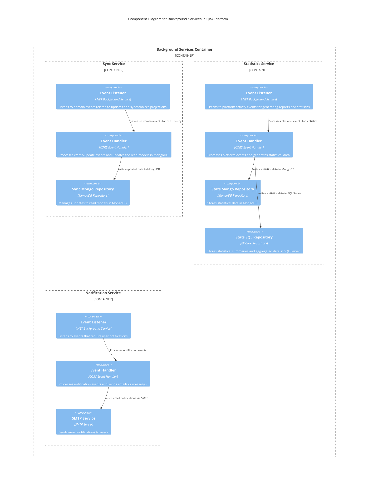

# Architectural Description of QnA Platform

The QnA Platform is designed following the principles of Domain-Driven Design (DDD) and leverages patterns such as CQRS (Command Query Responsibility Segregation) and Event Sourcing. This architecture ensures that both read and write operations are optimized, and data is consistently updated across the system.

## 1. System Context

The platform comprises several actors and external systems that interact to provide the required functionality. The core components are:

- **QnA API**: Handles user interactions and orchestrates requests to different services.
- **Sync Service**: Manages eventual consistency by processing domain events and updating projections.
- **Statistics Service**: Processes events to generate analytical data and metrics.
- **Notification Service**: Sends notifications to users based on various events.
- **SQL Database**: Stores structured data related to user information, questions, answers, and votes.
- **MongoDB**: Stores read-optimized views for fast querying and reporting.
- **RabbitMQ / Azure Event Hub**: Provides messaging capabilities to decouple services and handle asynchronous events.
- **SMTP Server**: Used for sending out email notifications to users.
- **Azure Application Insights**: Centralized telemetry and monitoring system for analyzing logs and performance metrics.

```mermaid
    C4Context
    title Context Diagram for QnA Platform

    %% Definition of People (Actors)
    Person(User, "User", "Interacts with the platform by asking questions, providing answers, and voting.")
    Person(Moderator, "Moderator", "Moderates content and manages users.")
    Person(Admin, "Administrator", "Manages system configuration and administrative tasks.")

    %% Definition of the Main System
    Enterprise_Boundary(QnA_Boundary, "QnA System Boundary") {
        System(QnA_WebApp, "QnA Web Application", "Web interface for users and moderators to interact with the platform.")
        System(QnA_API, "QnA REST API", "Provides data and functionality to interact with the QnA system.")
        System(Sync_Service, "Sync Service", "Synchronizes data between the system and external sources.")
        System(Stats_Service, "Statistics Service", "Generates reports and statistics based on platform activity.")
        System(Notification_Service, "Notification Service", "Handles sending notifications to users.")
        
        %% External Systems
        SystemDb(SQLServer, "SQL Database", "Stores user information, questions, answers, and votes.")
        SystemDb(MongoDB, "MongoDB", "NoSQL database for optimized read views.")
        SystemQueue(RabbitMQ, "RabbitMQ/Azure Event Hub", "Messaging system for coordinating events between services.")
        System(Seq, "Seq", "Centralized logging system for analyzing application logs and events.")
        System(Email_Service, "SMTP Server", "Sends email notifications to users.")
        System(AppInsights, "Azure Application Insights", "Monitors and analyzes application performance.")
    }

    %% Relationships between People and Systems
    Rel(User, QnA_WebApp, "Interacts with the platform through the web interface")
    Rel(Moderator, QnA_WebApp, "Moderates content and manages users")
    Rel(Admin, QnA_API, "Manages system configuration")

    %% Relationships between Systems
    Rel(QnA_WebApp, QnA_API, "Sends requests to REST API")
    Rel(QnA_API, SQLServer, "Stores and retrieves data for questions, answers, and users")
    Rel(QnA_API, MongoDB, "Retrieves optimized read views")
    Rel(QnA_API, RabbitMQ, "Publishes and subscribes to events")
    Rel(Sync_Service, RabbitMQ, "Synchronizes data between services")
    Rel(Stats_Service, RabbitMQ, "Processes events for generating statistics")
    Rel(Notification_Service, RabbitMQ, "Handles notification events")
    Rel(Notification_Service, Email_Service, "Sends email notifications to users")
    Rel(QnA_API, Seq, "Logs application events and errors")
    Rel(QnA_API, AppInsights, "Monitors application performance and logs")

    %% Styles and Layout Configuration
    UpdateElementStyle(User, $fontColor="black", $bgColor="lightyellow", $borderColor="black")
    UpdateElementStyle(Moderator, $fontColor="black", $bgColor="lightyellow", $borderColor="black")
    UpdateElementStyle(Admin, $fontColor="black", $bgColor="lightyellow", $borderColor="black")

    UpdateRelStyle(User, QnA_WebApp, $textColor="blue", $lineColor="blue", $offsetX="5")
    UpdateRelStyle(QnA_WebApp, QnA_API, $textColor="green", $lineColor="green", $offsetY="-10")
    UpdateRelStyle(QnA_API, SQLServer, $textColor="red", $lineColor="red", $offsetY="-20", $offsetX="10")
    UpdateRelStyle(QnA_API, MongoDB, $textColor="orange", $lineColor="orange", $offsetY="20", $offsetX="10")
    UpdateRelStyle(QnA_API, RabbitMQ, $textColor="purple", $lineColor="purple", $offsetY="-30", $offsetX="10")
    UpdateRelStyle(RabbitMQ, Sync_Service, $textColor="gray", $lineColor="gray", $offsetY="-40", $offsetX="20")
    UpdateRelStyle(RabbitMQ, Stats_Service, $textColor="gray", $lineColor="gray", $offsetY="-50", $offsetX="30")
    UpdateRelStyle(RabbitMQ, Notification_Service, $textColor="gray", $lineColor="gray", $offsetY="-60", $offsetX="40")

    UpdateLayoutConfig($c4ShapeInRow="4", $c4BoundaryInRow="1")

```

## 2. Container Diagram

The container diagram provides an overview of the main components of the QnA Platform and how they interact at a higher level. Each service has a specific role:

- **QnA Web Application**: The main user interface for interacting with the platform, built using Angular.
- **QnA API**: .NET Core-based REST API that exposes the platform's functionality to external clients.
- **Sync Service**: Keeps read models in sync with the command side by processing events asynchronously.
- **Statistics Service**: Consumes events to generate statistical insights and analytics.
- **Notification Service**: Listens to various events and triggers notifications to users.
- **SQL Database**: Central repository for storing structured data.
- **MongoDB**: Stores pre-aggregated data for faster querying and read operations.
- **RabbitMQ / Azure Event Hub**: Decouples services using a publish-subscribe model.
- **SMTP Server**: Delivers email notifications to users.
- **Azure Application Insights**: Aggregates logs and metrics for monitoring and diagnostics.

```mermaid
    C4Container
    title Container Diagram for QnA Platform

    %% Define External Systems and People
    Person_Ext(User, "User", "Interacts with the platform by asking questions, providing answers, and voting.")
    Person_Ext(Moderator, "Moderator", "Moderates content and manages users.")
    Person_Ext(Admin, "Administrator", "Manages system configuration and administrative tasks.")
    
    System_Ext(SMTP_Server, "SMTP Server", "Handles sending emails to users and admins.")
    System_Ext(AppInsights, "Azure Application Insights", "Monitors and analyzes application performance and logs.")
    SystemQueue_Ext(RabbitMQ, "RabbitMQ/Azure Event Hub", "Messaging system for coordinating events between services.")

    Container_Boundary(QnA_Boundary, "QnA Platform") {

        %% Define the Containers within the QnA Platform
        Container(QnA_WebApp, "QnA Web Application", "Angular & ASP.NET Core", "Provides the web interface for users and moderators.")
        Container(QnA_API, "QnA REST API", ".NET Core Web API", "Handles all user, question, answer, and vote operations via HTTP.")
        
        ContainerDb(SQLServer, "SQL Database", "SQL Server", "Stores structured data such as user information, questions, answers, and votes.")
        ContainerDb(MongoDB, "MongoDB", "NoSQL Database", "Stores read-optimized views for improved query performance.")

        Container(Sync_Service, "Sync Service", ".NET Core Background Service", "Synchronizes data between different sources and ensures eventual consistency.")
        Container(Stats_Service, "Statistics Service", ".NET Core Background Service", "Processes events from RabbitMQ/Azure Event Hub to generate statistics and insights.")
        Container(Notification_Service, "Notification Service", ".NET Core Background Service", "Handles sending notifications to users and administrators based on events.")
        Container(Seq, "Seq Logging Platform", "Seq", "Centralized logging platform for analyzing application logs and events.")

    }

    %% Relationships Between People and Web Application
    Rel(User, QnA_WebApp, "Interacts with")
    Rel(Moderator, QnA_WebApp, "Moderates content through")
    Rel(Admin, QnA_WebApp, "Manages configurations using")

    %% Relationships Between Web Application and API
    Rel(QnA_WebApp, QnA_API, "Sends requests to REST API via HTTP")

    %% Relationships Between API and Other Containers
    Rel(QnA_API, SQLServer, "Reads from and writes to", "JDBC")
    Rel(QnA_API, MongoDB, "Reads from and updates read views in", "MongoDB Driver")
    Rel(QnA_API, RabbitMQ, "Publishes and subscribes to events in")
    Rel(QnA_API, Seq, "Sends logs and traces to")

    %% Relationships Between Background Services and Messaging System
    Rel(Sync_Service, RabbitMQ, "Consumes events for data synchronization")
    Rel(Stats_Service, RabbitMQ, "Consumes events to generate statistics")
    Rel(Notification_Service, RabbitMQ, "Consumes notification events")

    %% Relationships Between Background Services and External Systems
    Rel(Notification_Service, SMTP_Server, "Sends emails via SMTP")
    Rel(QnA_API, AppInsights, "Logs performance data to")

    %% Styles and Layout Configuration
    UpdateElementStyle(User, $fontColor="black", $bgColor="lightyellow", $borderColor="black")
    UpdateElementStyle(Moderator, $fontColor="black", $bgColor="lightyellow", $borderColor="black")
    UpdateElementStyle(Admin, $fontColor="black", $bgColor="lightyellow", $borderColor="black")

    UpdateRelStyle(User, QnA_WebApp, $textColor="blue", $lineColor="blue", $offsetX="5")
    UpdateRelStyle(QnA_WebApp, QnA_API, $textColor="green", $lineColor="green", $offsetY="-10")
    UpdateRelStyle(QnA_API, SQLServer, $textColor="red", $lineColor="red", $offsetY="-20", $offsetX="10")
    UpdateRelStyle(QnA_API, MongoDB, $textColor="orange", $lineColor="orange", $offsetY="20", $offsetX="10")
    UpdateRelStyle(QnA_API, RabbitMQ, $textColor="purple", $lineColor="purple", $offsetY="-30", $offsetX="10")
    UpdateRelStyle(RabbitMQ, Sync_Service, $textColor="gray", $lineColor="gray", $offsetY="-40", $offsetX="20")
    UpdateRelStyle(RabbitMQ, Stats_Service, $textColor="gray", $lineColor="gray", $offsetY="-50", $offsetX="30")
    UpdateRelStyle(RabbitMQ, Notification_Service, $textColor="gray", $lineColor="gray", $offsetY="-60", $offsetX="40")

    UpdateLayoutConfig($c4ShapeInRow="4", $c4BoundaryInRow="1")

```

## 3. Component Diagram: QnA API

The QnA API is structured with a vertical slice architecture. It consists of multiple components, each responsible for a specific feature or entity in the system. The main components include:

- **Auth Component**: Manages user authentication and authorization.
- **Account Component**: Handles user account management, such as profile updates and settings.
- **Question Component**: Manages question-related operations, including creation, updates, and deletion.
- **Answer Component**: Manages answers, linking them to questions and processing votes.
- **Vote Component**: Manages upvotes and downvotes on questions and answers.

These components interact through the CQRS pattern, where commands handle state changes, and queries return the current state without modifying it.

```mermaid
C4Component
title Component Diagram for QnA REST API (Vertical Slice Architecture)

%% Define the QnA API Container Boundary
Container_Boundary(QnA_API_Boundary, "QnA REST API - Vertical Slice Architecture") {

    %% Define Slices and Controllers at the Top Level
    Container_Boundary(UserProfile_Slice, "UserProfile Slice") {
        Component(UserProfileController, "User Profile Controller", "ASP.NET Core MVC Controller", "Manages user profile information and updates.")
        Component(UserProfileCommandHandlers, "User Profile Command Handlers", "CQRS Command Handlers", "Handles create, update, and delete operations for user profiles.")
        Component(UserProfileQueryHandlers, "User Profile Query Handlers", "CQRS Query Handlers", "Handles read operations for user profiles.")
        Component(UserProfileSqlRepository, "User Profile SQL Repository", "EF Core Repository", "Manages user profile-related data in SQL Server.")
        Component(UserProfileMongoRepository, "User Profile Mongo Repository", "MongoDB Repository", "Manages user profile-related data in MongoDB.")
    }

    Container_Boundary(Question_Slice, "Question Slice") {
        Component(QuestionController, "Question Controller", "ASP.NET Core MVC Controller", "Handles CRUD operations for questions.")
        Component(QuestionCommandHandlers, "Question Command Handlers", "CQRS Command Handlers", "Handles create, update, and delete operations for questions.")
        Component(QuestionQueryHandlers, "Question Query Handlers", "CQRS Query Handlers", "Handles read operations for questions.")
        Component(QuestionSqlRepository, "Question SQL Repository", "EF Core Repository", "Manages question-related data in SQL Server.")
        Component(QuestionMongoRepository, "Question Mongo Repository", "MongoDB Repository", "Manages question-related data in MongoDB.")
    }

    Container_Boundary(Answer_Slice, "Answer Slice") {
        Component(AnswerController, "Answer Controller", "ASP.NET Core MVC Controller", "Handles CRUD operations for answers.")
        Component(AnswerCommandHandlers, "Answer Command Handlers", "CQRS Command Handlers", "Handles create, update, and delete operations for answers.")
        Component(AnswerQueryHandlers, "Answer Query Handlers", "CQRS Query Handlers", "Handles read operations for answers.")
        Component(AnswerSqlRepository, "Answer SQL Repository", "EF Core Repository", "Manages answer-related data in SQL Server.")
        Component(AnswerMongoRepository, "Answer Mongo Repository", "MongoDB Repository", "Manages answer-related data in MongoDB.")
    }

    Container_Boundary(Vote_Slice, "Vote Slice") {
        Component(VoteController, "Vote Controller", "ASP.NET Core MVC Controller", "Manages voting on questions and answers.")
        Component(VoteCommandHandlers, "Vote Command Handlers", "CQRS Command Handlers", "Handles create, update, and delete operations for votes.")
        Component(VoteQueryHandlers, "Vote Query Handlers", "CQRS Query Handlers", "Handles read operations for votes.")
        Component(VoteSqlRepository, "Vote SQL Repository", "EF Core Repository", "Manages vote-related data in SQL Server.")
        Component(VoteMongoRepository, "Vote Mongo Repository", "MongoDB Repository", "Manages vote-related data in MongoDB.")
    }

    Container_Boundary(Account_Slice, "Account Slice") {
        Component(AccountController, "Account Controller", "ASP.NET Core MVC Controller", "Handles account management and updates.")
        Component(AccountCommandHandlers, "Account Command Handlers", "CQRS Command Handlers", "Handles create, update, and delete operations for accounts.")
        Component(AccountQueryHandlers, "Account Query Handlers", "CQRS Query Handlers", "Handles read operations for accounts.")
        Component(AccountSqlRepository, "Account SQL Repository", "EF Core Repository", "Manages account-related data in SQL Server.")
        Component(AccountMongoRepository, "Account Mongo Repository", "MongoDB Repository", "Manages account-related data in MongoDB.")
    }
}

%% Relationships Between Controllers and Command/Query Handlers (Organized Vertically by Slice)
Rel(UserProfileController, UserProfileCommandHandlers, "Handles profile commands")
Rel(UserProfileController, UserProfileQueryHandlers, "Handles profile queries")
Rel(QuestionController, QuestionCommandHandlers, "Handles question commands")
Rel(QuestionController, QuestionQueryHandlers, "Handles question queries")
Rel(AnswerController, AnswerCommandHandlers, "Handles answer commands")
Rel(AnswerController, AnswerQueryHandlers, "Handles answer queries")
Rel(VoteController, VoteCommandHandlers, "Handles vote commands")
Rel(VoteController, VoteQueryHandlers, "Handles vote queries")
Rel(AccountController, AccountCommandHandlers, "Handles account commands")
Rel(AccountController, AccountQueryHandlers, "Handles account queries")

%% Relationships Between Command/Query Handlers and Repositories
Rel(UserProfileCommandHandlers, UserProfileSqlRepository, "Writes to SQL Server")
Rel(UserProfileQueryHandlers, UserProfileSqlRepository, "Reads from SQL Server")
Rel(UserProfileCommandHandlers, UserProfileMongoRepository, "Writes to MongoDB read views")
Rel(UserProfileQueryHandlers, UserProfileMongoRepository, "Reads from MongoDB read views")

Rel(QuestionCommandHandlers, QuestionSqlRepository, "Writes to SQL Server")
Rel(QuestionQueryHandlers, QuestionSqlRepository, "Reads from SQL Server")
Rel(QuestionCommandHandlers, QuestionMongoRepository, "Writes to MongoDB read views")
Rel(QuestionQueryHandlers, QuestionMongoRepository, "Reads from MongoDB read views")

Rel(AnswerCommandHandlers, AnswerSqlRepository, "Writes to SQL Server")
Rel(AnswerQueryHandlers, AnswerSqlRepository, "Reads from SQL Server")
Rel(AnswerCommandHandlers, AnswerMongoRepository, "Writes to MongoDB read views")
Rel(AnswerQueryHandlers, AnswerMongoRepository, "Reads from MongoDB read views")

Rel(VoteCommandHandlers, VoteSqlRepository, "Writes to SQL Server")
Rel(VoteQueryHandlers, VoteSqlRepository, "Reads from SQL Server")
Rel(VoteCommandHandlers, VoteMongoRepository, "Writes to MongoDB read views")
Rel(VoteQueryHandlers, VoteMongoRepository, "Reads from MongoDB read views")

Rel(AccountCommandHandlers, AccountSqlRepository, "Writes to SQL Server")
Rel(AccountQueryHandlers, AccountSqlRepository, "Reads from SQL Server")
Rel(AccountCommandHandlers, AccountMongoRepository, "Writes to MongoDB read views")
Rel(AccountQueryHandlers, AccountMongoRepository, "Reads from MongoDB read views")

```

## 4. Component Diagram: Background Services

The background services in the QnA platform operate independently to process specific tasks. Each service is responsible for a particular aspect of the platform:

- **Sync Service**: Ensures consistency between the command side and read side by processing domain events.
- **Statistics Service**: Aggregates data and produces analytical insights based on platform usage.
- **Notification Service**: Listens to events such as new answers or votes and sends notifications via email or in-app messages.

These services communicate using RabbitMQ or Azure Event Hub, depending on the configuration.

## 5. Code Diagram: QnA API Internal Structure

The code diagram provides a deeper look into the internal interactions of each component within the QnA API, focusing on class structures, method calls, and dependencies.

[Code Diagram: QnA API Internal Structure]

```mermaid
C4Component
title Code Diagram for QnA API Internal Structure

%% Define the QnA API Internal Structure
Container_Boundary(QnA_API_Internal, "QnA API") {

    %% Controllers
    Component(AccountController, "Account Controller", "ASP.NET Core MVC Controller", "Handles HTTP requests related to user accounts.")
    Component(QuestionController, "Question Controller", "ASP.NET Core MVC Controller", "Handles HTTP requests related to questions.")
    Component(AnswerController, "Answer Controller", "ASP.NET Core MVC Controller", "Handles HTTP requests related to answers.")
    Component(VoteController, "Vote Controller", "ASP.NET Core MVC Controller", "Handles HTTP requests related to votes.")
    Component(AuthController, "Auth Controller", "ASP.NET Core MVC Controller", "Handles authentication and authorization requests.")

    %% Commands and Handlers
    Container_Boundary(Commands, "Commands and Handlers") {
        Component(CreateUserCommand, "Create User Command", "CQRS Command", "Command to create a new user in the system.")
        Component(CreateUserCommandHandler, "Create User Command Handler", "CQRS Command Handler", "Handles user creation logic and data persistence.")

        Component(UpdateQuestionCommand, "Update Question Command", "CQRS Command", "Command to update question details.")
        Component(UpdateQuestionCommandHandler, "Update Question Command Handler", "CQRS Command Handler", "Handles question updates in the system.")

        Component(SubmitAnswerCommand, "Submit Answer Command", "CQRS Command", "Command to submit a new answer to a question.")
        Component(SubmitAnswerCommandHandler, "Submit Answer Command Handler", "CQRS Command Handler", "Handles answer submission and updates.")
    }

    %% Queries and Handlers
    Container_Boundary(Queries, "Queries and Handlers") {
        Component(GetUserProfileQuery, "Get User Profile Query", "CQRS Query", "Query to retrieve user profile information.")
        Component(GetUserProfileQueryHandler, "Get User Profile Query Handler", "CQRS Query Handler", "Handles user profile retrieval from the read store.")

        Component(GetQuestionByIdQuery, "Get Question By ID Query", "CQRS Query", "Query to retrieve details of a specific question by its ID.")
        Component(GetQuestionByIdQueryHandler, "Get Question By ID Query Handler", "CQRS Query Handler", "Handles question retrieval logic.")
    }

    %% Repositories
    Container_Boundary(Repositories, "Repositories") {
        Component(UserRepository, "User Repository", "EF Core Repository", "Handles data access for user entities in SQL Server.")
        Component(QuestionRepository, "Question Repository", "EF Core Repository", "Handles data access for question entities in SQL Server.")
        Component(AnswerRepository, "Answer Repository", "EF Core Repository", "Handles data access for answer entities in SQL Server.")
        Component(VoteRepository, "Vote Repository", "EF Core Repository", "Handles data access for vote entities in SQL Server.")
    }

    %% Event Handlers (Domain Events)
    Container_Boundary(EventHandlers, "Domain Event Handlers") {
        Component(UserCreatedEventHandler, "User Created Event Handler", "Domain Event Handler", "Handles post-creation actions for user entities.")
        Component(QuestionUpdatedEventHandler, "Question Updated Event Handler", "Domain Event Handler", "Handles actions after a question is updated.")
        Component(AnswerSubmittedEventHandler, "Answer Submitted Event Handler", "Domain Event Handler", "Handles actions after a new answer is submitted.")
    }

}

%% Relationships between Controllers, Commands, Queries and Repositories
Rel(AccountController, CreateUserCommand, "Submits create user request")
Rel(CreateUserCommand, CreateUserCommandHandler, "Invokes")
Rel(CreateUserCommandHandler, UserRepository, "Writes user data to SQL Server")

Rel(QuestionController, UpdateQuestionCommand, "Submits update question request")
Rel(UpdateQuestionCommand, UpdateQuestionCommandHandler, "Invokes")
Rel(UpdateQuestionCommandHandler, QuestionRepository, "Writes question data to SQL Server")

Rel(AnswerController, SubmitAnswerCommand, "Submits new answer request")
Rel(SubmitAnswerCommand, SubmitAnswerCommandHandler, "Invokes")
Rel(SubmitAnswerCommandHandler, AnswerRepository, "Writes answer data to SQL Server")

Rel(AccountController, GetUserProfileQuery, "Submits user profile query")
Rel(GetUserProfileQuery, GetUserProfileQueryHandler, "Invokes")
Rel(GetUserProfileQueryHandler, UserRepository, "Reads user data from SQL Server")

Rel(QuestionController, GetQuestionByIdQuery, "Submits question retrieval request")
Rel(GetQuestionByIdQuery, GetQuestionByIdQueryHandler, "Invokes")
Rel(GetQuestionByIdQueryHandler, QuestionRepository, "Reads question data from SQL Server")

Rel(UserCreatedEventHandler, UserRepository, "Reads user data")
Rel(QuestionUpdatedEventHandler, QuestionRepository, "Reads updated question data")
Rel(AnswerSubmittedEventHandler, AnswerRepository, "Reads submitted answer data")

```

