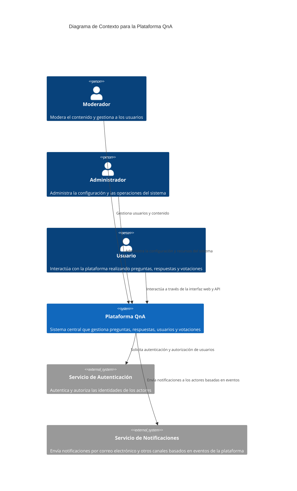
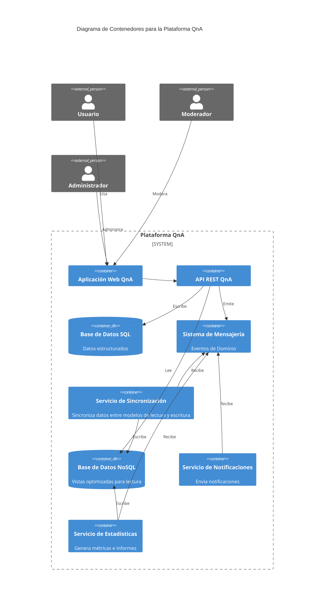
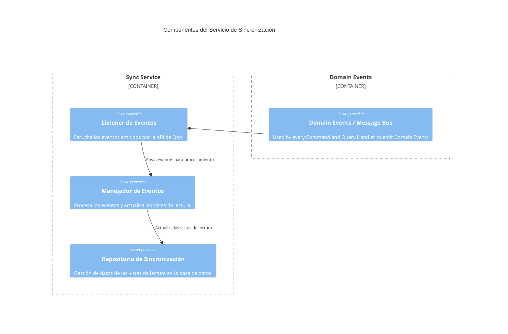
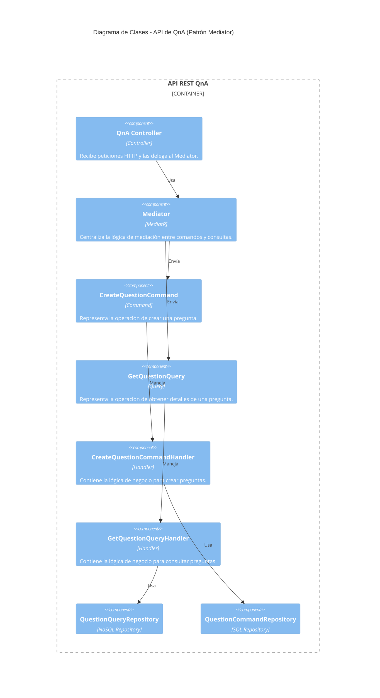
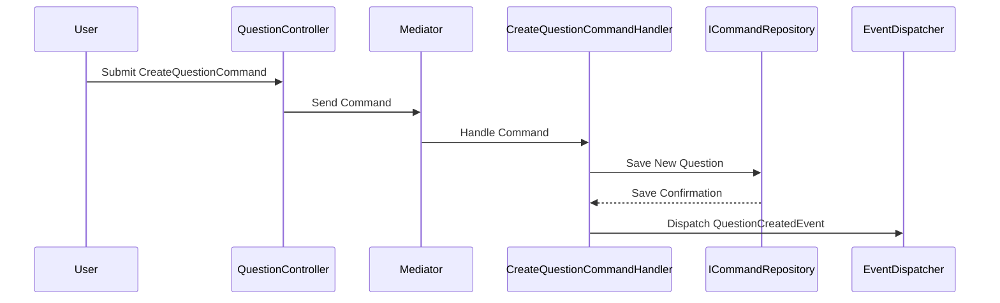
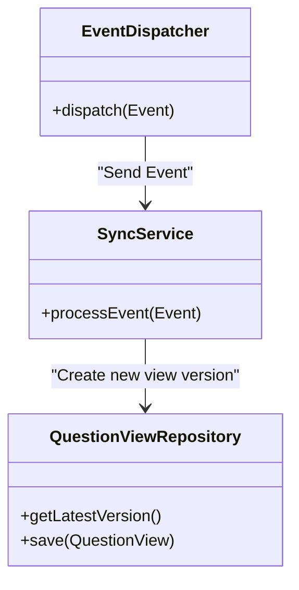

# Descripción de la Arquitectura de la Plataforma QnA

La plataforma QnA está diseñada bajo los principios de **Diseño Orientado al Dominio (DDD)** y utiliza patrones como **CQRS (Segregación de Responsabilidades de Comandos y Consultas)** y **Event Sourcing (Registro de Eventos)**. Esta arquitectura permite optimizar tanto las operaciones de lectura como de escritura, garantizando que los datos se actualicen de forma consistente en todo el sistema.

## Índice

1. [Contexto del Sistema](#1-contexto-del-sistema)
2. [Diagrama de Contenedores](#2-diagrama-de-contenedores)
3. [Diagrama de Componentes](#3-diagrama-de-componentes)
4. [Diagrama de Código](#4-diagrama-de-código)
5. [Resumen y Consideraciones Finales](#5-resumen-y-consideraciones-finales)

## 1. Contexto del Sistema

El diagrama de contexto proporciona una visión general del sistema y muestra cómo interactúa con actores y sistemas externos. A continuación se presentan los actores principales y las relaciones con los sistemas externos:

### Actores Principales
- **Usuario**: Persona que interactúa con la plataforma a través de la interfaz web para realizar acciones como hacer preguntas, responder, y votar.
- **Moderador**: Persona encargada de supervisar el contenido y gestionar a los usuarios.
- **Administrador**: Responsable de la configuración y mantenimiento del sistema.

### Sistemas Externos
- **SMTP Server**: Utilizado para enviar notificaciones por correo electrónico a los usuarios.
- **Sistema de Mensajería (RabbitMQ/Azure Event Hub)**: Facilita la comunicación entre servicios a través de eventos.
- **Aplicación de Monitorización (Azure Application Insights)**: Centraliza la recopilación de logs y análisis de rendimiento.

## 2. Diagrama de Contenedores

El diagrama de contenedores descompone el sistema en contenedores lógicos y muestra cómo interactúan entre sí. Cada contenedor representa una aplicación o servicio que realiza una función específica dentro del sistema.

### Contenedores Principales
- **API de QnA**: Interfaz RESTful que gestiona todas las operaciones relacionadas con usuarios, preguntas y respuestas.
- **Servicio de Sincronización**: Procesa eventos para mantener la consistencia entre los modelos de lectura y escritura.
- **Servicio de Estadísticas**: Genera informes y métricas basadas en la actividad de la plataforma.
- **Servicio de Notificaciones**: Envío de notificaciones a los usuarios basado en eventos.
- **Base de Datos SQL**: Almacena datos estructurados como información de usuarios y contenido.
- **MongoDB**: Almacena vistas optimizadas para consultas rápidas.
- **Sistema de Mensajería**: RabbitMQ o Azure Event Hub para la comunicación entre servicios.

## 3. Diagrama de Componentes

El diagrama de componentes profundiza en la estructura interna de cada contenedor, mostrando los diferentes módulos y cómo se comunican entre ellos. A continuación se listan los componentes más importantes de la API de QnA y el Servicio de Sincronización.

### 3.1 Componentes de la API de QnA

La **API de QnA** está organizada en base a un enfoque de **Slices Verticales** o **Microcomponentes**, lo que significa que cada funcionalidad principal (Usuarios, Preguntas, Respuestas, Votaciones) tiene sus propios controladores, comandos, consultas y repositorios. Esto permite un mantenimiento más sencillo y una mayor escalabilidad.

#### Componentes Principales
- **Users Slice**: Gestiona la gestión de perfiles.
- **Questions Slice**: Maneja la creación, actualización y eliminación de preguntas.
- **Answers Slice**: Controla el flujo de respuestas y su asociación con preguntas.
- **Votes Slice**: Administra el sistema de votaciones para preguntas y respuestas.

Cada uno de estos componentes sigue la siguiente estructura interna:

1. **Controladores** (`Controllers`): Interfaz HTTP que expone las operaciones disponibles.
2. **Manejadores de Comandos** (`Command Handlers`): Ejecutan operaciones que modifican el estado del sistema.
3. **Manejadores de Consultas** (`Query Handlers`): Devuelven datos desde el sistema, sin modificar su estado.
4. **Repositorios** (`Repositories`): Encargados del acceso y persistencia de datos.

```mermaid
C4Component
title Componentes de la API de QnA

%% Definición de la API de QnA y sus Componentes
Container_Boundary(QnA_API, "API REST QnA") {
    Container_Boundary(User_Slice, "Users Slice") {
        Component(UserController, "User Controller", "", "Gestiona peticiones HTTP relacionadas con usuarios.")
        Component(UserCommandHandlers, "Command Handlers", "", "")
        Component(UserQueryHandlers, "Query Handlers", "", "")        
        Component(UserCommandRepository, "Sql Repository", "", "")
        Component(UserQueryRepository, "NoSQL Repository", "", "")  
    }

    Container_Boundary(Question_Slice, "Questions Slice") {
        Component(QuestionController, "Controlador de Preguntas", "", "Gestiona peticiones HTTP relacionadas con preguntas.")
        Component(QuestionCommandHandlers, "Command Handlers", "", "")
        Component(QuestionQueryHandlers, "Query Handlers", "", "")
        Component(QuestionCommandRepository, "Sql Repository", "", "")
        Component(QuestionQueryRepository, "NoSQL Repository", "", "")
        }

    Container_Boundary(Answer_Slice, "Answers Slice") {
        Component(AnswerController, "Controlador de Respuestas", "", "Gestiona peticiones HTTP relacionadas con respuestas.")
        Component(AnswerCommandHandlers, "Command Handlers", "", "")
        Component(AnswerQueryHandlers, "Query Handlers", "", "")
        Component(AnswerCommandRepository, "Sql Repository", "", "")
        Component(AnswerQueryRepository, "NoSQL Repository", "", "")
    }

    Container_Boundary(Vote_Slice, "Votes Slice") {
        Component(VoteController, "Controlador de Votaciones", "", "Gestiona peticiones HTTP relacionadas con votaciones.")
        Component(VoteCommandHandlers, "Command Handlers", "", "")
        Component(VoteQueryHandlers, "Query Handlers", "", "")
        Component(VoteCommandRepository, "Sql Repository", "", "")
        Component(VoteQueryRepository, "NoSQL Repository", "", "")
    }
          
    Component(UserMessages, "Domain Events / Message Bus", "", "Used by every Command and Query Handler to emit Domain Events")
}

%% Relaciones entre Controladores, Manejadores y Repositorios
Rel(UserController, UserCommandHandlers, "")
Rel(UserController, UserQueryHandlers, "")
Rel(UserCommandHandlers, UserCommandRepository, "")
Rel(UserQueryHandlers, UserQueryRepository, "")

Rel(QuestionController, QuestionCommandHandlers, "")
Rel(QuestionController, QuestionQueryHandlers, "")
Rel(QuestionCommandHandlers, QuestionCommandRepository, "")
Rel(QuestionQueryHandlers, QuestionQueryRepository, "")

Rel(AnswerController, AnswerCommandHandlers, "Invoca comandos")
Rel(AnswerController, AnswerQueryHandlers, "Realiza consultas")
Rel(AnswerCommandHandlers, AnswerCommandRepository, "Actualiza datos")
Rel(AnswerQueryHandlers, AnswerQueryRepository, "Lee datos")

Rel(VoteController, VoteCommandHandlers, "Invoca comandos")
Rel(VoteController, VoteQueryHandlers, "Realiza consultas")
Rel(VoteCommandHandlers, VoteCommandRepository, "Actualiza datos")
Rel(VoteQueryHandlers, VoteQueryRepository, "Lee datos")


%% Configuración de Layout para organizar los elementos
UpdateLayoutConfig($c4ShapeInRow="2", $c4BoundaryInRow="1")

```

### 3.2 Componentes del Servicio de Sincronización
El Servicio de Sincronización es responsable de asegurar que la base de datos de lectura se mantenga actualizada con los cambios en la base de datos de comandos. Se organiza en componentes que escuchan eventos y actualizan las vistas de lectura en consecuencia.

#### Componentes Principales
Listener de Eventos: Escucha los eventos emitidos por la API de QnA.
Manejador de Eventos: Procesa cada evento y realiza las actualizaciones necesarias en la base de datos de lectura.
Repositorio de Sincronización: Encargado de gestionar el acceso y persistencia de las vistas de lectura.

# 4. Componentes
## 4.1 API
Un ejemplo de diagramas de código del servicio de sincronización. 

#### 3.3. Servicio de sincronización
Un ejemplo de diagramas de código del servicio de sincronización. 

## 5. Resumen y Consideraciones Finales
La arquitectura de la plataforma QnA combina DDD, CQRS, y el patrón Mediator para mantener una arquitectura limpia y escalable. La utilización de diagramas C4 facilita la comprensión y la colaboración entre equipos, proporcionando una referencia visual clara de cómo se estructura y se comunica cada parte del sistema.

# NOTE
THIS IS STILL A WORK IN PROGRESS