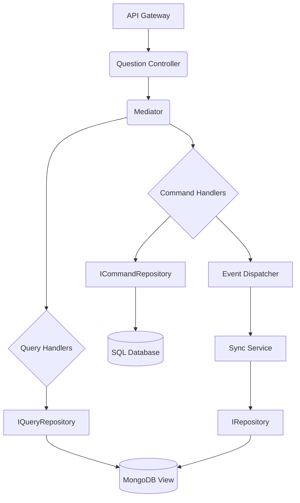
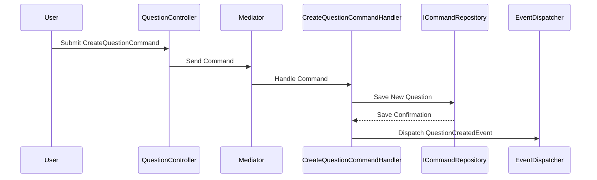
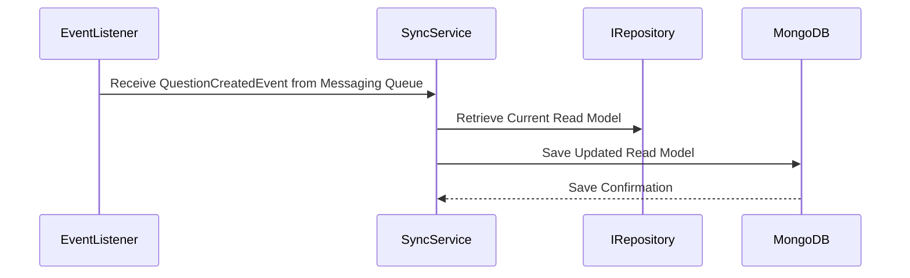
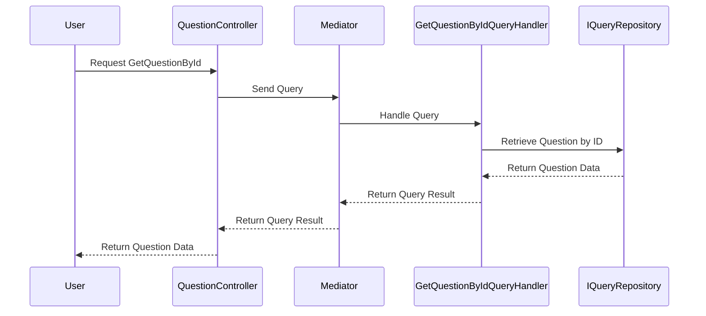
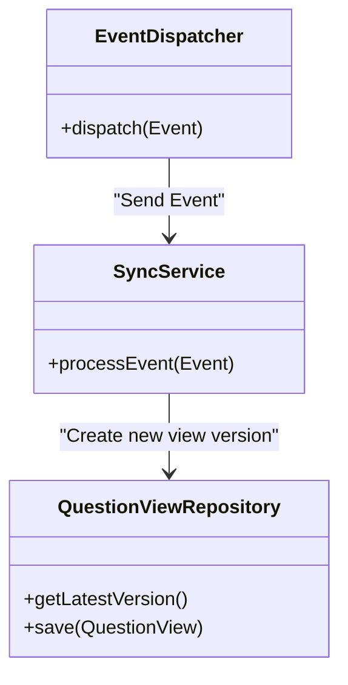
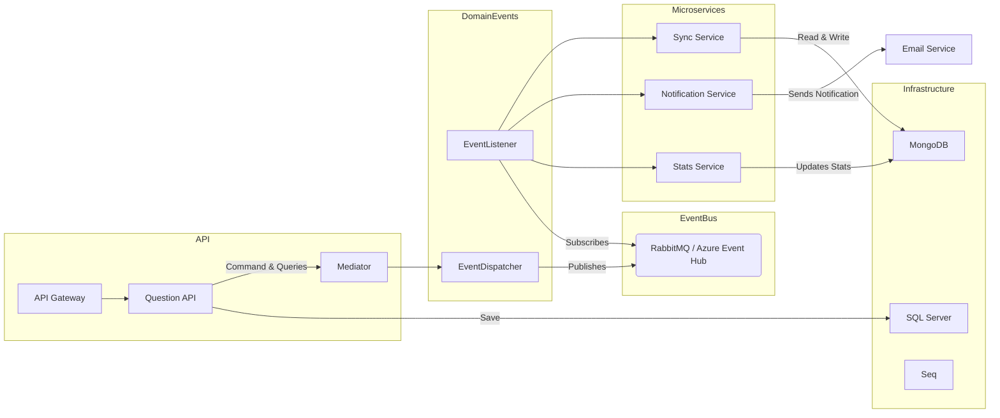

# Design Guidelines for QnA System

This document explains the architectural design and core components of the QnA system. The project uses a combination of **CQRS**, **DDD**, **Mediator Pattern**, and **Vertical Slice Architecture** to maintain separation of concerns and enable scalability. Below, we detail how each part of the system is structured and how UML diagrams can help visualize the architecture.

## 1. Overview of the QnA Architecture

The QnA platform is built around the concept of a Question and Answer (Q&A) system, with a core entity being the `Question`. Commands and Queries are handled separately through the use of **CQRS** and the **Mediator Pattern** (via the `MediatR` library), ensuring that reads and writes are well isolated. The system integrates SQL for command storage and NoSQL (MongoDB) for read-only views, making it a perfect fit for **eventual consistency** scenarios.

Below is a high-level component diagram of the services and dependencies:

**Figure 1**: Component diagram showing how the API communicates with the core services through `MediatR` and how each service interacts with the underlying repositories and databases.

## 2. Command Flow: Creating a New Question

### 2.1 API Side

The system uses `MediatR` to handle commands and distribute them to the correct handlers. For example, when a user creates a new question, the following flow is executed:

**Figure 2.1**: Sequence diagram showing the creation of a new question, persisting it in the `ICommandRepository`, and dispatching an event through the `EventDispatcher`.

### Explanation:
1. **User** sends a `CreateQuestionCommand` to the **QuestionController**.
2. The **Controller** forwards the command to **Mediator**.
3. **Mediator** finds the appropriate handler, which is `CreateQuestionCommandHandler`, and sends the command for handling.
4. The handler writes the new `Question` to the **ICommandRepository**.
5. After successfully saving to the repository, the handler dispatches a `QuestionCreatedEvent`.

### 2.2 SyncService Side

After the `CreateQuestionCommand` is handled and a `QuestionCreatedEvent` is dispatched, the `SyncService` uses an `EventListener` to react to this event and update the read model stored in MongoDB. This ensures that the read model remains consistent with the latest state of the domain entities. The flow is as follows:

**Figure 2.2**: Sequence diagram illustrating how the Sync Service listens to domain events through an `EventListener`, retrieves the current read model, and updates the MongoDB view accordingly.

### Explanation:
1. **EventListener** receives the `QuestionCreatedEvent` from the messaging queue (e.g., RabbitMQ or Azure Event Hub).
2. The **EventListener** notifies the **Sync Service** of the new event.
3. The **Sync Service** retrieves the latest version of the current read model from **IRepository**.
4. The **Sync Service** updates the read model and saves it back to **MongoDB**.
5. **MongoDB** confirms that the updated read model has been saved successfully.

This process ensures that the read model, used by the Query Handlers, is always up-to-date and reflects the latest changes in the system, without directly coupling the write and read sides of the application.

## 3. Query Flow: Retrieving a Question

Queries are handled differently from commands, as they only read data and do not modify the state of the system. The following sequence diagram shows the process of retrieving a question by its ID:

**Figure 3**: Sequence diagram for handling a query to retrieve question data from the `IQueryRepository`.

## 4. Eventual Consistency and Sync Service

The `Sync Service` is responsible for maintaining the consistency between the command and query repositories. Whenever a new event is dispatched (e.g., `QuestionCreatedEvent`), the Sync Service updates the read model in MongoDB by creating a new version of the document.

**Figure 4**: Class diagram showing how the Sync Service processes events and creates new versions of the views in MongoDB.

## 5. Components Architecture Overview

The following diagram provides an overview of the microservices and their interactions with the message bus and databases. Each service is deployed as a separate container, allowing for independent scaling and fault isolation.

**Figure 5**: Components Architecture Overview. This diagram illustrates the main containers deployed in the solution, including the core services such as the API, Sync Service, Notification Service, and Stats Service. Each service is isolated, running in its own container, and uses the appropriate repository and dependencies. Communication between services happens through a message broker (RabbitMQ or Azure Event Hub). Supporting components include SQL Server for command persistence, MongoDB for read model storage, and Seq for logging and monitoring. This architecture ensures clear separation of concerns, scalability, and maintains eventual consistency across microservices.

### Explanation:

1. **API Gateway**: Routes requests to the **Question API** for commands and queries, which are handled by the **Mediator** pattern.
2. **Domain Events**: Events are dispatched through the `EventDispatcher` and listened to by `EventListener`.
3. **Sync Service**: Receives domain events and updates the read models in **MongoDB**.
4. **Notification Service**: Listens for specific events and triggers notifications through the **Email Service**.
5. **Stats Service**: Updates statistics in **MongoDB** based on events, independently of other services.
6. **SQL Server**: Holds the main data for the domain, used by the command side.
7. **MongoDB**: Stores the read models, which are kept up-to-date by the Sync Service.
8. **Seq**: Provides monitoring and logging for better observability.
9. **Event Bus**: RabbitMQ or Azure Event Hub is used for asynchronous event propagation among services. 

With this architecture, each microservice can operate independently and scale according to its load, while maintaining consistency and collaboration through events in the message bus.

## Conclusion

The QnA system leverages a combination of **CQRS**, **DDD**, and the **Mediator Pattern** to maintain a clean and scalable architecture. The use of UML diagrams helps visualize the flow and interactions between various components, making it easier to understand and maintain the system. For more information, refer to the source code and other documentation files in this repository.
